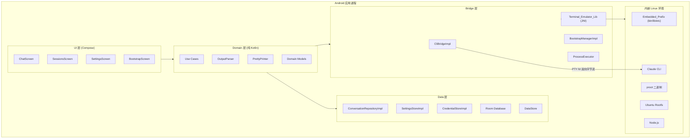
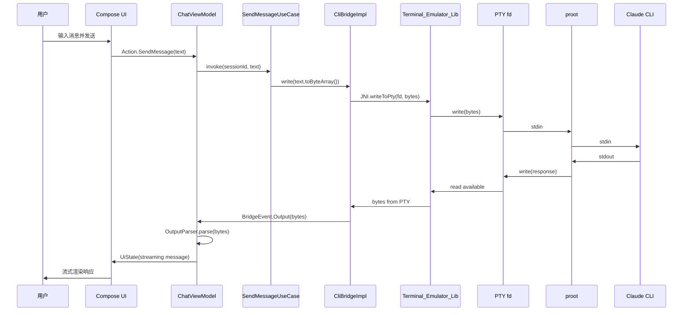
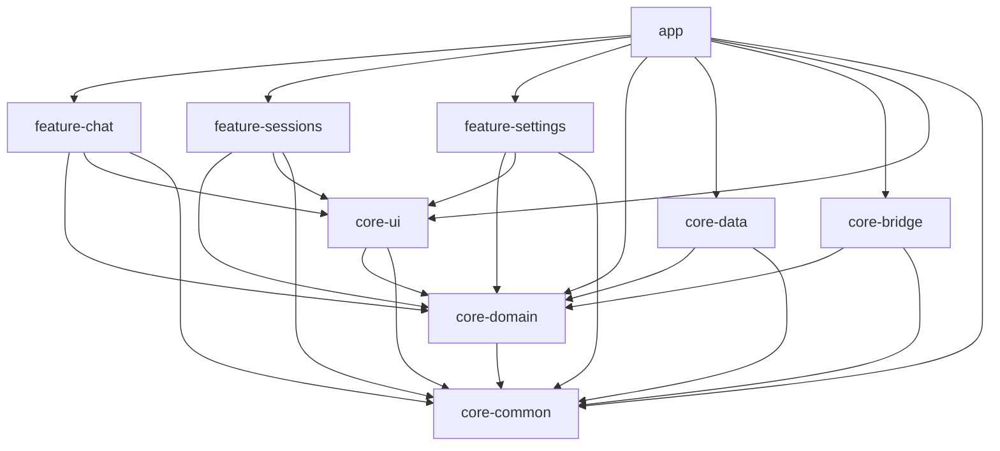
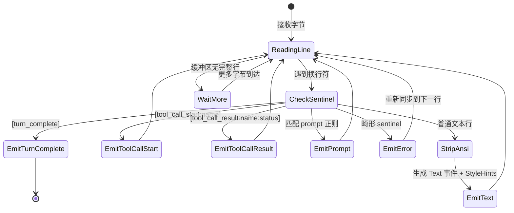
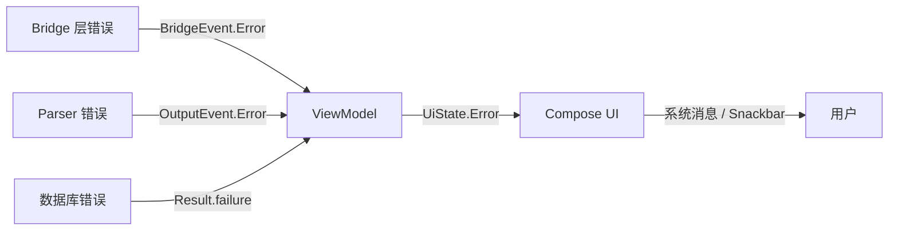

# 技术设计文档

## 概述

本文档描述 Android Claude Mobile Client 的技术设计方案。该应用是一个自包含的 Android 原生应用，通过内嵌的终端模拟器库（Termux `terminal-emulator` JNI 库）在应用进程内运行 Claude Code CLI，无需安装任何外部应用。

### 核心设计目标

1. **自包含性**：所有 Linux 环境组件（prefix 文件系统、proot、Ubuntu rootfs、Node.js、Claude CLI）均打包在 APK 内或首次启动时下载，存储在应用私有目录中。
2. **进程内 PTY 通信**：通过 Terminal_Emulator_Lib 的 JNI 接口在应用进程内分配 PTY、fork/exec 子进程，实现与 Claude CLI 的双向字节流通信。
3. **流式渲染**：PTY 输出经 Output_Parser 解析为结构化事件，实时流式渲染到 Compose UI。
4. **Clean Architecture**：严格分层（UI → Domain → Data/Bridge），通过 Hilt 依赖注入，确保可测试性和模块化。

### 技术栈

| 层级 | 技术选型 |
|------|----------|
| UI | Jetpack Compose + Material 3 |
| 状态管理 | ViewModel + StateFlow + UDF |
| 依赖注入 | Hilt (Dagger) |
| 异步 | Kotlin Coroutines + Flow |
| 持久化 | Room (会话/消息) + DataStore (设置) |
| 安全存储 | EncryptedSharedPreferences + Android Keystore |
| 终端 | Termux terminal-emulator JNI (JitPack) |
| Linux 环境 | proot + Ubuntu rootfs |
| 测试 | JUnit 5 + Kotest (属性测试) + MockK + Turbine |

---

## 架构

### 系统架构图



### 进程通信架构



### 模块依赖关系



---

## 组件与接口

### 1. Terminal_Emulator_Lib JNI 集成

Terminal_Emulator_Lib 提供 JNI 层的 PTY 分配和进程管理能力。核心 JNI 接口：

```kotlin
/**
 * JNI 封装层，提供 PTY 分配和进程 fork/exec 能力。
 * 基于 Termux terminal-emulator 库的 JNI.java 接口。
 */
object TerminalJni {
    /**
     * 创建子进程并分配 PTY。
     * @param cmd 要执行的命令路径
     * @param cwd 工作目录
     * @param args 命令参数数组
     * @param envVars 环境变量数组 (格式: "KEY=VALUE")
     * @param rows 终端行数
     * @param cols 终端列数
     * @return 包含 [pid, ptyFd] 的整数数组
     */
    external fun createSubprocess(
        cmd: String,
        cwd: String,
        args: Array<String>,
        envVars: Array<String>,
        rows: Int,
        cols: Int
    ): IntArray

    /** 向 PTY 写入字节 */
    external fun writeToPty(fd: Int, bytes: ByteArray, offset: Int, count: Int): Int

    /** 从 PTY 读取字节 */
    external fun readFromPty(fd: Int, buffer: ByteArray, offset: Int, count: Int): Int

    /** 关闭 PTY 文件描述符 */
    external fun closePty(fd: Int)

    /** 等待子进程退出 */
    external fun waitFor(pid: Int): Int

    /** 向进程发送信号 */
    external fun sendSignal(pid: Int, signal: Int)

    /** 设置终端窗口大小 */
    external fun setWindowSize(fd: Int, rows: Int, cols: Int)
}
```

**集成方式**：
- 通过 JitPack 依赖 `com.termux.termux-app:terminal-emulator` 获取预编译的 `.so` 库
- JNI 调用在 `ProcessExecutor` 中封装，对上层暴露 Kotlin 协程友好的 API
- PTY fd 的读写通过 `Dispatchers.IO` 线程池执行，避免阻塞主线程

### 2. Embedded_Prefix 结构与提取

Embedded_Prefix 是一个精简的 Termux 兼容 Linux 文件系统，存储在应用私有目录中：

```
{app_internal}/prefix/
├── bin/           # 基础工具 (sh, ls, cat, etc.)
├── lib/           # 共享库
├── etc/           # 配置文件
├── usr/
│   ├── bin/       # proot, tar, gzip 等
│   └── lib/       # 额外共享库
├── tmp/           # 临时目录
└── .version       # 版本标记文件 (JSON)
```

**版本标记文件格式**：

```json
{
  "prefixVersion": "1.0.0",
  "extractedAt": "2025-01-15T10:30:00Z",
  "archHash": "sha256:abc123..."
}
```

**提取流程**：

```kotlin
interface PrefixExtractor {
    /**
     * 从 APK assets 或远程 URL 提取 Embedded_Prefix。
     * @param targetDir 目标目录 (app internal storage)
     * @param onProgress 进度回调 (0.0 ~ 1.0)
     * @return 提取结果，包含版本信息
     */
    suspend fun extract(
        targetDir: File,
        onProgress: (Float) -> Unit
    ): Result<PrefixVersion>

    /**
     * 检查是否需要升级。
     * @param currentVersion 当前安装的版本
     * @param bundledVersion APK 中打包的版本
     */
    fun needsUpgrade(currentVersion: PrefixVersion, bundledVersion: PrefixVersion): Boolean
}
```

### 3. Proot 调用与 Bind Mount 配置

proot 通过以下方式调用，创建隔离的 Linux 环境：

```kotlin
/**
 * 构建 proot 命令行参数。
 * 
 * 生成的命令格式:
 * proot --rootfs=/path/to/rootfs \
 *   -b /dev:/dev \
 *   -b /proc:/proc \
 *   -b /sys:/sys \
 *   -b /workspace_host:/workspace \
 *   -w /workspace \
 *   /bin/bash -c "claude --model $MODEL ..."
 */
data class ProotConfig(
    val prootBinaryPath: String,
    val rootfsPath: String,
    val workspacePath: String,
    val mountPoint: String = "/workspace",
    val additionalBindMounts: Map<String, String> = mapOf(
        "/dev" to "/dev",
        "/proc" to "/proc",
        "/sys" to "/sys"
    )
) {
    fun buildCommandArgs(): List<String> {
        val args = mutableListOf<String>()
        args.add("--rootfs=$rootfsPath")
        
        // 系统 bind mounts
        additionalBindMounts.forEach { (host, guest) ->
            args.add("-b")
            args.add("$host:$guest")
        }
        
        // Workspace bind mount
        args.add("-b")
        args.add("$workspacePath:$mountPoint")
        
        // 工作目录
        args.add("-w")
        args.add(mountPoint)
        
        return args
    }
}
```

**安全边界**：proot 的 bind mount 配置确保 Claude CLI 只能访问：
- 用户选择的 Workspace 目录（挂载到 `/workspace`）
- 必要的系统虚拟文件系统（`/dev`、`/proc`、`/sys`）
- rootfs 内部的文件

### 4. Bridge 层通信架构

Bridge 层是 Compose UI 与嵌入式终端进程之间的通信桥梁：

```kotlin
/**
 * ProcessExecutor 封装 JNI 调用，提供协程友好的进程管理 API。
 */
interface ProcessExecutor {
    /**
     * 使用 Terminal_Emulator_Lib JNI 创建子进程。
     * 内部调用 TerminalJni.createSubprocess()。
     */
    suspend fun execute(config: SpawnConfig): Process

    /** 向指定 PID 发送 POSIX 信号 */
    suspend fun sendSignal(pid: Long, signal: PosixSignal)
}

/**
 * PTY 读写器，封装 fd 级别的 I/O 操作。
 */
class PtyChannel(private val fd: Int) {
    /** 从 PTY 读取可用字节，非阻塞 */
    suspend fun read(buffer: ByteArray): Int = withContext(Dispatchers.IO) {
        TerminalJni.readFromPty(fd, buffer, 0, buffer.size)
    }

    /** 向 PTY 写入字节 */
    suspend fun write(bytes: ByteArray) = withContext(Dispatchers.IO) {
        TerminalJni.writeToPty(fd, bytes, 0, bytes.size)
    }

    /** 关闭 PTY fd */
    fun close() {
        TerminalJni.closePty(fd)
    }
}
```

**数据流方向**：

```
用户输入 → ChatViewModel → CliBridge.write() → PtyChannel.write() → PTY fd → proot → Claude CLI
Claude CLI → proot → PTY fd → PtyChannel.read() → BridgeEvent.Output → OutputParser → UI 渲染
```

### 5. Output_Parser 处理流程

Output_Parser 是一个纯函数式组件，将 PTY 字节流解析为结构化事件：



**事件文法定义**：

```
stream       := line*
line         := (sentinel | prompt | text) NEWLINE
sentinel     := tool_start | tool_result | turn_complete
tool_start   := "[tool_call_start:" TOOL_NAME "]" ARGUMENTS
tool_result  := "[tool_call_result:" TOOL_NAME ":" STATUS "]" RESULT
turn_complete:= "[turn_complete]"
prompt       := WORD ">" SPACE
text         := (ANSI_SEQ | CHAR)*
ANSI_SEQ     := ESC "[" PARAMS TERMINATOR
STATUS       := "success" | "failure"
```

### 6. 多模块 Gradle 项目组织

```
ClaudeMobile/
├── app/                    # 应用入口，导航，DI 根
├── feature-chat/           # 聊天功能模块
├── feature-sessions/       # 会话列表功能模块
├── feature-settings/       # 设置功能模块
├── core-domain/            # 领域模型、接口、用例 (纯 Kotlin)
├── core-data/              # 数据层实现 (Room, DataStore, Keystore)
├── core-bridge/            # Bridge 层 (JNI, 进程管理, Bootstrap)
├── core-ui/                # 共享 UI 组件 (主题, 通用 Composable)
├── core-common/            # 通用工具 (Dispatchers, TimeProvider)
├── gradle/
│   └── libs.versions.toml  # 版本目录
├── build.gradle.kts        # 根构建脚本
└── settings.gradle.kts     # 模块声明
```

---

## 数据模型

### Room 数据库 Schema

```kotlin
// ===== Session 实体 =====
@Entity(tableName = "sessions")
data class SessionEntity(
    @PrimaryKey
    @ColumnInfo(name = "id")
    val id: String,

    @ColumnInfo(name = "title")
    val title: String,

    @ColumnInfo(name = "workspace_path")
    val workspacePath: String,

    @ColumnInfo(name = "created_at")
    val createdAt: Long,  // epoch millis

    @ColumnInfo(name = "last_activity_at")
    val lastActivityAt: Long,  // epoch millis

    @ColumnInfo(name = "message_count")
    val messageCount: Int
)

// ===== Message 实体 =====
@Entity(
    tableName = "messages",
    foreignKeys = [
        ForeignKey(
            entity = SessionEntity::class,
            parentColumns = ["id"],
            childColumns = ["session_id"],
            onDelete = ForeignKey.CASCADE
        )
    ],
    indices = [Index("session_id")]
)
data class MessageEntity(
    @PrimaryKey
    @ColumnInfo(name = "id")
    val id: String,

    @ColumnInfo(name = "session_id")
    val sessionId: String,

    @ColumnInfo(name = "role")
    val role: String,  // "user", "assistant", "tool", "system"

    @ColumnInfo(name = "created_at")
    val createdAt: Long,  // epoch millis

    @ColumnInfo(name = "position")
    val position: Int,

    @ColumnInfo(name = "content")
    val content: String,

    @ColumnInfo(name = "status")
    val status: String,  // "sending", "streaming", "complete", "cancelled", "error"

    @ColumnInfo(name = "tool_name")
    val toolName: String? = null,

    @ColumnInfo(name = "tool_arguments")
    val toolArguments: String? = null,

    @ColumnInfo(name = "tool_result")
    val toolResult: String? = null,

    @ColumnInfo(name = "tool_status")
    val toolStatus: String? = null  // "pending", "running", "completed", "failed"
)

// ===== Diagnostics 实体 =====
@Entity(tableName = "diagnostics_log")
data class DiagnosticsLogEntity(
    @PrimaryKey(autoGenerate = true)
    @ColumnInfo(name = "id")
    val id: Long = 0,

    @ColumnInfo(name = "session_id")
    val sessionId: String?,

    @ColumnInfo(name = "event_type")
    val eventType: String,

    @ColumnInfo(name = "message")
    val message: String,

    @ColumnInfo(name = "details")
    val details: String?,

    @ColumnInfo(name = "timestamp")
    val timestamp: Long  // epoch millis
)
```

### DAO 接口

```kotlin
@Dao
interface SessionDao {
    @Query("SELECT * FROM sessions ORDER BY last_activity_at DESC")
    fun getAllSessionsFlow(): Flow<List<SessionEntity>>

    @Query("SELECT * FROM sessions WHERE id = :id")
    suspend fun getById(id: String): SessionEntity?

    @Insert(onConflict = OnConflictStrategy.REPLACE)
    suspend fun insert(session: SessionEntity)

    @Update
    suspend fun update(session: SessionEntity)

    @Query("DELETE FROM sessions WHERE id = :id")
    suspend fun deleteById(id: String)
}

@Dao
interface MessageDao {
    @Query("SELECT * FROM messages WHERE session_id = :sessionId ORDER BY position ASC")
    fun getMessagesForSessionFlow(sessionId: String): Flow<List<MessageEntity>>

    @Query("SELECT * FROM messages WHERE session_id = :sessionId ORDER BY position ASC")
    suspend fun getMessagesForSession(sessionId: String): List<MessageEntity>

    @Insert(onConflict = OnConflictStrategy.REPLACE)
    suspend fun insert(message: MessageEntity)

    @Update
    suspend fun update(message: MessageEntity)

    @Query("DELETE FROM messages WHERE session_id = :sessionId")
    suspend fun deleteBySessionId(sessionId: String)

    @Query("SELECT MAX(position) FROM messages WHERE session_id = :sessionId")
    suspend fun getMaxPosition(sessionId: String): Int?
}
```

### DataStore Schema（设置）

```kotlin
/**
 * DataStore 使用 Preferences DataStore，键定义如下：
 */
object SettingsKeys {
    val MODEL_ID = stringPreferencesKey("model_id")
    val SYSTEM_PROMPT = stringPreferencesKey("system_prompt")
    val THEME_MODE = stringPreferencesKey("theme_mode")
    val FONT_SCALE = floatPreferencesKey("font_scale")
    val STREAMING_RENDER_RATE = longPreferencesKey("streaming_render_rate_ms")
    val DEFAULT_WORKSPACE_PATH = stringPreferencesKey("default_workspace_path")
    val AUTO_START_FOREGROUND_SERVICE = booleanPreferencesKey("auto_start_fg_service")
}

/**
 * 有效值范围定义：
 * - fontScale: [0.5, 3.0]，默认 1.0
 * - streamingRenderRate: [16, 1000] ms，默认 50
 * - themeMode: "system" | "light" | "dark"，默认 "system"
 */
```

### Hilt 依赖注入模块结构

```kotlin
// ===== core-data 模块 =====
@Module
@InstallIn(SingletonComponent::class)
object DatabaseModule {
    @Provides @Singleton
    fun provideDatabase(@ApplicationContext context: Context): AppDatabase
    
    @Provides
    fun provideSessionDao(db: AppDatabase): SessionDao
    
    @Provides
    fun provideMessageDao(db: AppDatabase): MessageDao
    
    @Provides
    fun provideDiagnosticsLogDao(db: AppDatabase): DiagnosticsLogDao
}

@Module
@InstallIn(SingletonComponent::class)
abstract class RepositoryModule {
    @Binds @Singleton
    abstract fun bindConversationRepository(
        impl: ConversationRepositoryImpl
    ): ConversationRepository
}

@Module
@InstallIn(SingletonComponent::class)
abstract class SettingsModule {
    @Binds @Singleton
    abstract fun bindSettingsStore(impl: SettingsStoreImpl): SettingsStore
}

@Module
@InstallIn(SingletonComponent::class)
abstract class CredentialStoreModule {
    @Binds @Singleton
    abstract fun bindCredentialStore(impl: CredentialStoreImpl): CredentialStore
}

// ===== core-bridge 模块 =====
@Module
@InstallIn(SingletonComponent::class)
abstract class BridgeModule {
    @Binds @Singleton
    abstract fun bindCliBridge(impl: CliBridgeImpl): CliBridge
}

@Module
@InstallIn(SingletonComponent::class)
abstract class BootstrapModule {
    @Binds @Singleton
    abstract fun bindBootstrapManager(impl: BootstrapManagerImpl): BootstrapManager
}

@Module
@InstallIn(SingletonComponent::class)
object ProcessModule {
    @Provides @Singleton
    fun provideProcessExecutor(
        @ApplicationContext context: Context,
        dispatchers: CoroutineDispatchers
    ): ProcessExecutor = JniProcessExecutor(context, dispatchers)
}

// ===== core-common 模块 =====
@Module
@InstallIn(SingletonComponent::class)
object CommonModule {
    @Provides @Singleton
    fun provideCoroutineDispatchers(): CoroutineDispatchers
    
    @Provides @Singleton
    fun provideTimeProvider(): TimeProvider
}
```

---

## 正确性属性

*属性（Property）是一种在系统所有有效执行中都应保持为真的特征或行为——本质上是关于系统应该做什么的形式化陈述。属性是人类可读规范与机器可验证正确性保证之间的桥梁。*

### 属性 1: Proot 命令构建正确性

*对于任意*有效的 workspace 路径和 SpawnConfig 配置，生成的 proot 命令参数应当包含：(a) `--rootfs` 指向正确的 rootfs 路径，(b) workspace 目录的 bind mount (`-b workspace:/workspace`)，(c) 必要的系统 bind mounts (`/dev`、`/proc`、`/sys`)，(d) 工作目录设置为 mount point。

**验证: 需求 2.2, 8.3, 8.6**

### 属性 2: 环境变量完整性

*对于任意*有效的 SpawnConfig（包含非空 workspace 路径和 API key），构建的环境变量映射应当包含 `HOME`、`PATH`、`TERM`、`LANG`、`ANTHROPIC_API_KEY` 五个键，且所有值均非空。

**验证: 需求 2.3**

### 属性 3: 退出码分类确定性

*对于任意*整数退出码，`classifyExitCause` 函数应当返回一个有效的 ExitCause 枚举值，且满足：退出码 0 映射到 NORMAL，退出码 130 映射到 USER_CANCELLED，退出码 137 映射到 KILLED_BY_OS，其他大于 128 的退出码映射到 CRASH。

**验证: 需求 2.10**

### 属性 4: 单进程不变量

*对于任意*会话和任意 spawn 操作序列，在任一时刻活跃的 Claude CLI 进程数不超过 1。当新的 spawn 请求到达时，如果已有活跃进程，旧进程应当被终止后再启动新进程。

**验证: 需求 2.13**

### 属性 5: ANSI 剥离保留文本内容

*对于任意*包含 ANSI SGR 转义序列的字节流，剥离 ANSI 序列后得到的纯文本应当等于原始字节流中所有非转义序列字符的拼接。StyleHint 的范围应当覆盖且仅覆盖对应 SGR 代码影响的文本区间。

**验证: 需求 4.2**

### 属性 6: 流重组往返一致性

*对于任意*由 PTY_Bridge 产生的单轮字节序列 `b`，将 OutputParser 解析产生的所有 `Text` 事件的 content 按顺序拼接，应当等于直接对 `b` 剥离 ANSI 转义序列后的字符串。

**验证: 需求 4.7**

### 属性 7: Parser/Printer 往返（字节方向）

*对于任意*被 OutputParser 接受且不产生 `Error` 事件的字节流 `b`，执行 `parse(b)` 得到事件 `e`，通过 PrettyPrinter 的 `eventsToBytes(e)` 得到 `b'`，再执行 `parse(b')` 得到 `e'`，则 `e'` 应当与 `e` 在定义的事件等价关系下等价。

**验证: 需求 14.3**

### 属性 8: Parser/Printer 往返（事件方向）

*对于任意*有效的 OutputEvent 列表 `events`，通过 PrettyPrinter 的 `eventsToBytes(events)` 序列化为字节流，再由 OutputParser 解析，应当产生与原始 `events` 等价的事件序列。

**验证: 需求 14.2**

### 属性 9: Parser 错误恢复

*对于任意*包含一个畸形 sentinel 的字节流（在有效内容之间插入），OutputParser 应当：(a) 对畸形部分恰好发出一个 `Error` 事件，(b) 在下一个可识别的帧边界（换行符）处重新同步，(c) 继续正确解析后续有效内容。

**验证: 需求 14.4**

### 属性 10: Session/Message 持久化往返

*对于任意*有效的 Session `s` 和关联的 Message 列表 `ms`，通过 ConversationRepository 写入后再读取，应当得到与写入值相同的 Session 和 Message 数据（id、title、workspacePath、timestamps、role、position、content 等字段均相等）。

**验证: 需求 5.10**

### 属性 11: Session 列表排序不变量

*对于任意*包含多个 Session 的数据库状态，通过 `getAllSessionsFlow()` 获取的列表应当严格按 `lastActivityAt` 降序排列。

**验证: 需求 5.6**

### 属性 12: Message 位置排序不变量

*对于任意* Session 的 Message 列表，通过 `getMessagesForSession()` 获取的列表应当严格按 `position` 升序排列。

**验证: 需求 5.7**

### 属性 13: 设置往返

*对于任意*偏好设置键 `k` 和该键有效范围内的值 `v`，通过 SettingsStore 写入 `v` 到 `k` 后再读取 `k`，应当返回 `v`。

**验证: 需求 9.6**

### 属性 14: 设置范围校验回退

*对于任意* `fontScale` 值在 `[0.5, 3.0]` 范围之外，或 `streamingRenderRate` 值在 `[16, 1000]` 范围之外，SettingsStore 读取时应当返回对应的默认值（fontScale=1.0, streamingRenderRate=50）。

**验证: 需求 9.4**

### 属性 15: API Key 掩码

*对于任意*非空 API key 字符串，掩码表示应当：(a) 不包含完整的原始 key，(b) 最多显示最后 4 个字符，(c) 其余部分用掩码字符替代。

**验证: 需求 6.3**

### 属性 16: 诊断日志脱敏

*对于任意*包含 API key 的诊断日志文本和任意 API key 值，通过导出分享操作后的文本不应当包含该 API key 的任何出现。

**验证: 需求 13.5**

### 属性 17: 重试不重复消息

*对于任意*失败的消息和重试操作，重试后会话中的用户消息总数应当保持不变（不会因重试而产生重复的用户消息）。

**验证: 需求 11.3**

### 属性 18: 对比度合规性

*对于任意*主题（light/dark）中的文本颜色与背景颜色组合，标准文本的对比度应当不低于 4.5:1，大文本的对比度应当不低于 3:1。

**验证: 需求 15.3**

---

## 错误处理

### 错误分类与处理策略

| 错误类别 | 来源 | 处理策略 |
|----------|------|----------|
| Bootstrap 失败 | 存储空间不足、网络错误、提取错误 | 显示具体错误 + 重试按钮 + 空间建议 |
| 进程 spawn 失败 | fork 失败、exec 失败、proot 启动错误 | 显示命令行 + 错误码 + 最后 4096 字节 stderr |
| PTY I/O 错误 | fd 关闭、进程意外退出 | 发出 BridgeEvent.Error + 标记消息状态 |
| 网络错误 | Claude CLI 报告的 API 连接失败 | 结构化系统消息 + 重试操作 |
| 解析错误 | 畸形 sentinel、不符合文法的字节 | 发出 Error 事件 + 重新同步 |
| Keystore 不可用 | 设备解锁方式变更导致密钥失效 | 提示用户重新输入凭据 |
| OS 杀死服务 | 系统内存压力 | 下次启动检测 + 标记消息为 killed_by_os |
| 数据库错误 | Room 操作失败 | 可恢复错误状态 + 重试操作 |

### 错误传播路径



### 信号升级协议

```
用户请求取消
    ↓ (< 200ms)
发送 SIGINT
    ↓ (等待 5 秒)
进程未退出? → 发送 SIGTERM
    ↓ (等待 5 秒)
进程仍未退出? → 发送 SIGKILL + destroyForcibly()
    ↓
清理资源 + 发出 ProcessExited 事件
```

---

## 测试策略

### 双重测试方法

本项目采用**单元测试 + 属性测试**的双重策略：

- **单元测试**：验证具体示例、边界条件和错误路径
- **属性测试**：验证跨所有输入的通用属性（使用 Kotest Property Testing）

### 属性测试配置

- **库**: Kotest Property (`io.kotest:kotest-property`)
- **最小迭代次数**: 每个属性测试 100 次迭代
- **标签格式**: `Feature: android-claude-termux-client, Property {number}: {property_text}`

```kotlin
// 属性测试示例结构
class OutputParserPropertyTest : FunSpec({
    test("Feature: android-claude-termux-client, Property 7: Parser/Printer round-trip (bytes)") {
        checkAll(100, validByteStreamArb()) { bytes ->
            val events = parser.parse(bytes).events
            // 跳过包含 Error 事件的流
            if (events.none { it is OutputEvent.Error }) {
                val serialized = prettyPrinter.eventsToBytes(events)
                val reparsed = parser.parse(serialized).events
                reparsed shouldBe events
            }
        }
    }
})
```

### 测试覆盖矩阵

| 组件 | 单元测试 | 属性测试 | 集成测试 |
|------|----------|----------|----------|
| OutputParser | 各事件类型解析 | 属性 5, 6, 7, 9 | - |
| PrettyPrinter | Markdown 渲染 | 属性 8 | - |
| ConversationRepository | CRUD 操作 | 属性 10, 11, 12 | Room 内存数据库 |
| SettingsStore | 各偏好读写 | 属性 13, 14 | DataStore 测试 |
| CliBridge | spawn/terminate 流程 | 属性 3, 4 | JNI 集成 |
| ProotConfig | 命令构建 | 属性 1, 2 | - |
| CredentialStore | 存储/删除/掩码 | 属性 15 | Keystore 集成 |
| DiagnosticsExporter | 导出/脱敏 | 属性 16 | - |
| RetryFailedTurnUseCase | 重试逻辑 | 属性 17 | - |
| Theme Colors | - | 属性 18 | - |

### 测试工具与框架

- **JUnit 5**: 测试运行器
- **Kotest**: 断言 (`kotest-assertions-core`) + 属性测试 (`kotest-property`)
- **MockK**: Mock 框架
- **Turbine**: Flow 测试
- **kotlinx-coroutines-test**: 协程测试
- **Room in-memory database**: 数据库集成测试

### CI 覆盖率要求

- Domain 层 use cases: ≥ 90% 行覆盖率
- Data 层 repositories: ≥ 85% 行覆盖率
- Bridge 层核心逻辑: ≥ 80% 行覆盖率
- Parser/Printer: ≥ 95% 行覆盖率（关键正确性组件）
