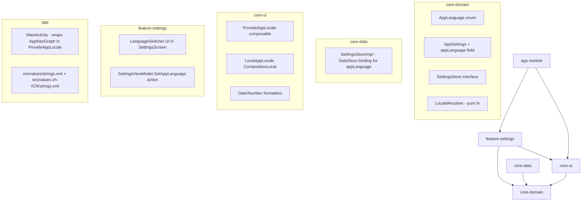
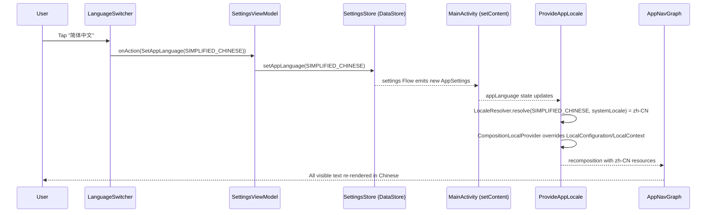
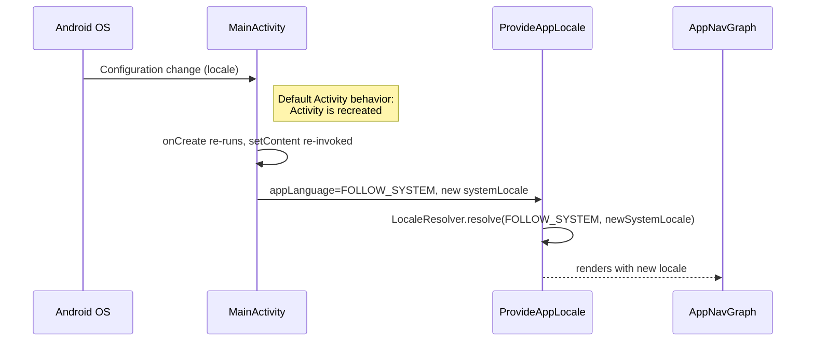

# Design Document

## Overview

The i18n-language-switching feature adds internationalization support to ClaudeMobile, enabling users to switch the app's display language between English, Simplified Chinese, and "Follow System". The implementation layers on top of Android's standard resource-qualifier system (`values/`, `values-zh-rCN/`) and drives locale selection through the existing `SettingsStore` (DataStore-backed). A dedicated `LocaleManager` resolves a user preference + system locale into an effective `Locale`, and a thin Compose wrapper overrides `LocalConfiguration` + `LocalContext` so that `stringResource(...)` and Android resource lookups resolve against the chosen locale without requiring Activity recreation.

### Design goals

- **No Activity recreation on explicit language change.** Switching languages happens via CompositionLocal overrides; the NavHost, scroll state, and text-field state survive unchanged.
- **Activity recreation is acceptable on system locale change.** When `FOLLOW_SYSTEM` is active and the OS locale changes, Android's default recreation is fine — the settings flow re-emits, and the resolver picks up the new system locale on the next composition.
- **Separation of concerns.** The SettingsStore persists only the user's *preference* (an `AppLanguage` enum); the resolver decides the *effective locale*; the Compose wrapper applies it.
- **Pure, testable core.** The locale-resolution logic is a pure function; persistence, resolver, and formatting are covered by property-based tests.

### Key design decisions

| Decision | Chosen approach | Rationale |
|---|---|---|
| Persistence unit | Store the user's *preference* (`AppLanguage` enum), not the resolved `Locale` | `FOLLOW_SYSTEM` must react to OS changes. Storing a Locale would freeze the choice. |
| Scope of persistence | Add `appLanguage` to existing `AppSettings` / `SettingsStore` | Matches existing pattern (`themeMode`, `fontScale`). No new DataStore file. |
| Apply mechanism | `CompositionLocalProvider` override of `LocalConfiguration`, `LocalContext`, and a new `LocalAppLocale` | Avoids Activity recreation for explicit changes. Works with Compose's standard string-resource path. |
| Android resource qualifier | `values-zh-rCN` for Simplified Chinese | `zh-rCN` is the correct qualifier for Simplified Chinese on Android's resource resolution chain; `zh` alone is ambiguous. |
| System-locale observation | Read `LocalConfiguration.current.locales[0]` inside the Compose tree | Automatically recomposes when Android delivers a new configuration. No manual BroadcastReceiver. |
| System locale→AppLanguage fallback | Resolver returns English if the system locale's language is not in `{en, zh}` | Per Requirement 1.4 / 5.5. |

## Architecture

### Module placement

The feature splits across four existing modules along the lines of their ownership:



- `core-domain` owns the `AppLanguage` enum, the pure `LocaleResolver`, and the updated `AppSettings` / `SettingsStore` interface.
- `core-data` implements persistence — extends `SettingsStoreImpl` with a new preference key and accessor.
- `core-ui` owns the `ProvideAppLocale` composable, the `LocalAppLocale` CompositionLocal, and locale-aware date/number formatters. This keeps i18n a UI concern and avoids `android.content.Context` leaking into `core-domain`.
- `feature-settings` adds the UI (Language section) and wires `SettingsAction.SetAppLanguage` into the existing `SettingsViewModel`.
- `app` wraps `AppNavGraph` inside `ProvideAppLocale` and hosts per-module-aggregated string resources in `values/` and `values-zh-rCN/`.

### Runtime flow: explicit language change



No Activity recreation occurs. Navigation back stack, scroll position, text fields, and ViewModels are preserved because only Compose state underneath `ProvideAppLocale` recomposes.

### Runtime flow: system locale change in FOLLOW_SYSTEM mode



Because Requirement 7.5 explicitly permits activity recreation (within 2 seconds) on system locale change, we do not declare `android:configChanges="locale|layoutDirection"` on `MainActivity`. The default recreation behavior is both simpler and consistent with the rest of the app (which already survives theme/config changes via SettingsStore-sourced state).

## Components and Interfaces

### 1. `AppLanguage` enum (core-domain)

```kotlin
package com.claudemobile.core.domain.model

import java.util.Locale

/**
 * User preference for the app's display language.
 *
 * - [FOLLOW_SYSTEM] defers to the device system locale (resolved at runtime).
 * - [ENGLISH] and [SIMPLIFIED_CHINESE] pin the app to an explicit language.
 */
public enum class AppLanguage {
    FOLLOW_SYSTEM,
    ENGLISH,
    SIMPLIFIED_CHINESE;

    public companion object {
        /** Default value for new installations (Req 5.4). */
        public val DEFAULT: AppLanguage = FOLLOW_SYSTEM
    }
}

/**
 * BCP-47 tag for each supported explicit language. Kept separate from
 * the enum so the resolver owns all Locale-construction logic.
 */
public object SupportedLocales {
    public val ENGLISH: Locale = Locale.forLanguageTag("en")
    public val SIMPLIFIED_CHINESE: Locale = Locale.forLanguageTag("zh-CN")

    /** Set of language subtags the app has string resources for. */
    public val SUPPORTED_LANGUAGE_TAGS: Set<String> = setOf("en", "zh")
}
```

### 2. `LocaleResolver` (core-domain, pure)

```kotlin
package com.claudemobile.core.domain.i18n

import com.claudemobile.core.domain.model.AppLanguage
import com.claudemobile.core.domain.model.SupportedLocales
import java.util.Locale

/**
 * Pure mapping from (user preference, system locale) to effective [Locale].
 *
 * Separated from [SettingsStore] so it can be called from both the
 * Compose layer (via [ProvideAppLocale]) and unit tests without any
 * Android dependencies.
 */
public object LocaleResolver {

    /**
     * Returns the [Locale] the app should render with, given the current
     * user preference and the current system locale.
     *
     * - For [AppLanguage.ENGLISH] / [AppLanguage.SIMPLIFIED_CHINESE], returns
     *   the pinned locale.
     * - For [AppLanguage.FOLLOW_SYSTEM], returns [systemLocale] if its
     *   language subtag is supported, otherwise falls back to English.
     */
    public fun resolve(
        preference: AppLanguage,
        systemLocale: Locale,
    ): Locale = when (preference) {
        AppLanguage.ENGLISH -> SupportedLocales.ENGLISH
        AppLanguage.SIMPLIFIED_CHINESE -> SupportedLocales.SIMPLIFIED_CHINESE
        AppLanguage.FOLLOW_SYSTEM -> {
            val language = systemLocale.language.lowercase(Locale.ROOT)
            when (language) {
                "zh" -> SupportedLocales.SIMPLIFIED_CHINESE
                "en" -> SupportedLocales.ENGLISH
                else -> SupportedLocales.ENGLISH // Req 1.4, 5.5
            }
        }
    }
}
```

### 3. `SettingsStore` additions (core-domain + core-data)

The existing `SettingsStore` interface and `AppSettings` data class gain one field each:

```kotlin
// AppSettings — new field
public data class AppSettings(
    // ... existing fields ...
    val appLanguage: AppLanguage = AppLanguage.DEFAULT, // Req 5.4
)

// SettingsStore — new setter
public interface SettingsStore {
    // ... existing members ...
    public suspend fun setAppLanguage(language: AppLanguage)
}

// PreferenceKeys — new key
public object PreferenceKeys {
    // ... existing constants ...
    public const val APP_LANGUAGE: String = "app_language"
}
```

`SettingsStoreImpl` additions (mirrors the existing `themeMode` pattern):

```kotlin
// Companion key
val KEY_APP_LANGUAGE = stringPreferencesKey(PreferenceKeys.APP_LANGUAGE)

// In settings Flow builder
appLanguage = prefs[KEY_APP_LANGUAGE]?.toAppLanguageOrDefault() ?: DEFAULTS.appLanguage

// Setter
override suspend fun setAppLanguage(language: AppLanguage) {
    dataStore.edit { prefs -> prefs[KEY_APP_LANGUAGE] = language.name }
}

private fun String.toAppLanguageOrDefault(): AppLanguage =
    try { AppLanguage.valueOf(this) }
    catch (_: IllegalArgumentException) { DEFAULTS.appLanguage } // Req 1.3
```

### 4. `LocalAppLocale` + `ProvideAppLocale` (core-ui)

```kotlin
package com.claudemobile.core.ui.i18n

import android.content.res.Configuration
import androidx.compose.runtime.Composable
import androidx.compose.runtime.CompositionLocalProvider
import androidx.compose.runtime.compositionLocalOf
import androidx.compose.runtime.remember
import androidx.compose.ui.platform.LocalConfiguration
import androidx.compose.ui.platform.LocalContext
import com.claudemobile.core.domain.i18n.LocaleResolver
import com.claudemobile.core.domain.model.AppLanguage
import java.util.Locale

/**
 * CompositionLocal exposing the app's currently effective [Locale].
 *
 * Consumers (e.g. date/number formatters, custom text layout) read this
 * instead of the platform's `LocalConfiguration.current.locales`, so that
 * formatting tracks the *app* locale rather than the system locale when
 * the two differ.
 */
public val LocalAppLocale: androidx.compose.runtime.ProvidableCompositionLocal<Locale> =
    compositionLocalOf { Locale.getDefault() }

/**
 * Wraps [content] so that Android resources, `stringResource(...)`, and
 * [LocalAppLocale] all resolve against the locale derived from the given
 * [appLanguage] preference and the current system locale.
 *
 * Implementation note: overriding `LocalConfiguration` alone is insufficient
 * — `stringResource` ultimately reads from `LocalContext.current.resources`.
 * We therefore also provide a locale-configured `Context` via
 * `createConfigurationContext`, and both CompositionLocals are overridden
 * in the same provider so they stay consistent.
 */
@Composable
public fun ProvideAppLocale(
    appLanguage: AppLanguage,
    content: @Composable () -> Unit,
) {
    val systemConfiguration = LocalConfiguration.current
    val baseContext = LocalContext.current

    // The system locale is the *first* entry in the locale list of the
    // configuration Compose gives us. Reading it inside composition means
    // recomposition happens automatically when the OS delivers a new
    // configuration (Req 5.3).
    val systemLocale: Locale = systemConfiguration.locales[0] ?: Locale.getDefault()
    val effectiveLocale: Locale = remember(appLanguage, systemLocale) {
        LocaleResolver.resolve(appLanguage, systemLocale)
    }

    // Build a new Configuration with the effective locale and a context
    // that resolves resources against it.
    val localizedConfiguration = remember(systemConfiguration, effectiveLocale) {
        Configuration(systemConfiguration).apply {
            setLocale(effectiveLocale)
            setLayoutDirection(effectiveLocale) // Req 7.1 — zh/en both LTR
        }
    }
    val localizedContext = remember(baseContext, effectiveLocale) {
        baseContext.createConfigurationContext(localizedConfiguration)
    }

    CompositionLocalProvider(
        LocalAppLocale provides effectiveLocale,
        LocalConfiguration provides localizedConfiguration,
        LocalContext provides localizedContext,
    ) {
        content()
    }
}
```

### 5. `AppLocaleFormatters` (core-ui)

```kotlin
package com.claudemobile.core.ui.i18n

import androidx.compose.runtime.Composable
import androidx.compose.runtime.ReadOnlyComposable
import androidx.compose.runtime.remember
import java.text.NumberFormat
import java.time.LocalDate
import java.time.format.DateTimeFormatter
import java.util.Locale

/**
 * Returns a locale-aware date formatter for the currently active app locale.
 *
 * - For [SupportedLocales.SIMPLIFIED_CHINESE]: pattern `yyyy年M月d日` (Req 6.1).
 * - For [SupportedLocales.ENGLISH]: pattern `MMM d, yyyy` (Req 6.2).
 */
@Composable
@ReadOnlyComposable
public fun rememberDateFormatter(): DateTimeFormatter {
    val locale = LocalAppLocale.current
    return DateTimeFormatter.ofPattern(datePatternFor(locale), locale)
}

internal fun datePatternFor(locale: Locale): String = when {
    locale.language.equals("zh", ignoreCase = true) -> "yyyy年M月d日"
    else -> "MMM d, yyyy"
}

/**
 * Returns a locale-aware NumberFormat. Per Req 6.3/6.4, both English and
 * Simplified Chinese use `.` as the decimal separator and `,` as the
 * thousands separator, so we can return the same grouping format — but we
 * still *request* it via the app locale so the [Locale] dependency is
 * explicit (and so that future-added languages slot in without refactoring).
 */
@Composable
public fun rememberNumberFormat(): NumberFormat {
    val locale = LocalAppLocale.current
    return remember(locale) {
        NumberFormat.getNumberInstance(locale).apply { isGroupingUsed = true }
    }
}
```

### 6. `MainActivity` integration (app)

```kotlin
setContent {
    val settings by settingsStore.settings.collectAsState(initial = AppSettings())
    // ... existing themeMode / startDestination / snackbar state ...

    ClaudeMobileTheme(themeMode = settings.themeMode) {
        ProvideAppLocale(appLanguage = settings.appLanguage) {
            // Existing Scaffold + AppNavGraph
        }
    }
}
```

`ProvideAppLocale` is the innermost wrapper inside the theme, so every `stringResource(...)` call within the nav graph, screens, dialogs, and snackbars resolves against the chosen locale.

### 7. Language switcher UI (feature-settings)

A new `LanguageSection` composable, inserted in `SettingsScreenContent` above `UiPreferencesSection`, mirrors the existing `ThemeMode` segmented-button pattern but uses a vertical list of radio buttons to make each native-script label (Req 3.4) fully legible.

```kotlin
@Composable
private fun LanguageSection(
    current: AppLanguage,
    onLanguageChange: (AppLanguage) -> Unit,
) {
    Column(verticalArrangement = Arrangement.spacedBy(8.dp)) {
        Text(
            // Resolves via ProvideAppLocale to "Language" (en) or "语言" (zh).
            text = stringResource(R.string.settings_language_title),
            style = MaterialTheme.typography.titleMedium,
        )
        AppLanguage.entries.forEach { lang ->
            Row(
                modifier = Modifier
                    .fillMaxWidth()
                    .selectable(
                        selected = current == lang,
                        role = Role.RadioButton,
                        onClick = { onLanguageChange(lang) },
                    )
                    .padding(vertical = 8.dp),
                verticalAlignment = Alignment.CenterVertically,
            ) {
                RadioButton(selected = current == lang, onClick = null)
                Spacer(Modifier.width(8.dp))
                Text(
                    text = lang.displayLabel(),
                    style = MaterialTheme.typography.bodyLarge,
                )
            }
        }
    }
}

@Composable
private fun AppLanguage.displayLabel(): String = when (this) {
    AppLanguage.FOLLOW_SYSTEM -> stringResource(R.string.settings_language_follow_system)
    AppLanguage.ENGLISH -> "English"         // Req 3.4 — native script, not translated
    AppLanguage.SIMPLIFIED_CHINESE -> "简体中文" // Req 3.4 — native script, not translated
}
```

The explicit-language labels ("English", "简体中文") are intentionally hardcoded in their native script rather than pulled from `strings.xml`: they must display the same regardless of the currently active locale. Only the "Follow System" label and the section title are translated.

`SettingsAction` and `SettingsViewModel` gain one new case:

```kotlin
public data class SetAppLanguage(val language: AppLanguage) : SettingsAction

// In onAction
is SettingsAction.SetAppLanguage -> setAppLanguage(action.language)

private fun setAppLanguage(language: AppLanguage) {
    viewModelScope.launch { settingsStore.setAppLanguage(language) }
}
```

## Data Models

### Settings entity (persisted)

| Field | Type | Default | Validation on read | DataStore key |
|---|---|---|---|---|
| `appLanguage` | `AppLanguage` | `FOLLOW_SYSTEM` | Unknown enum name → default (Req 1.3) | `"app_language"` |

Stored as the enum's `name` (string) for forward-compatibility when the enum evolves, mirroring `themeMode`.

### In-memory values

| Name | Type | Scope | Notes |
|---|---|---|---|
| `AppLanguage` | enum | app-wide | User preference |
| `effectiveLocale` | `java.util.Locale` | Compose subtree under `ProvideAppLocale` | Exposed as `LocalAppLocale.current` |
| `LocalConfiguration` (override) | `android.content.res.Configuration` | Compose subtree under `ProvideAppLocale` | Has locale replaced |
| `LocalContext` (override) | `android.content.Context` | Compose subtree under `ProvideAppLocale` | Wrapped via `createConfigurationContext` |

### String resources

- `app/src/main/res/values/strings.xml` — English (default).
- `app/src/main/res/values-zh-rCN/strings.xml` — Simplified Chinese.
- Per-feature-module `values/` and `values-zh-rCN/` directories for strings owned by that module (e.g. `feature-settings/src/main/res/values-zh-rCN/strings.xml`).
- Format arguments use positional specifiers (`%1$s`, `%2$d`) per Req 4.6.
- Missing keys in the Chinese file fall back automatically to `values/` via the Android resource resolution chain (Req 4.4) — no custom code required.


## Correctness Properties

*A property is a characteristic or behavior that should hold true across all valid executions of a system — essentially, a formal statement about what the system should do. Properties serve as the bridge between human-readable specifications and machine-verifiable correctness guarantees.*

The locale-resolution and persistence layers of this feature are pure, total functions over small, well-defined input domains, which makes them a strong fit for property-based testing. The Compose/UI rendering side is better validated with example-based Compose and instrumented tests (see Testing Strategy) — those properties are therefore not listed here.

### Property 1: LocaleResolver is a pure, deterministic function

*For any* `AppLanguage` preference `p` and any `Locale` `s`, `LocaleResolver.resolve(p, s)` returns the same result on every call (no hidden state, no side effects) and depends only on `(p, s)`.

**Validates: Requirements 2.2, 5.2**

### Property 2: LocaleResolver is total and returns only supported locales

*For any* `AppLanguage` preference `p` and any `Locale` `s` (including malformed, empty, or unsupported locales), `LocaleResolver.resolve(p, s)` returns without throwing, and the returned `Locale` is one of `SupportedLocales.ENGLISH` or `SupportedLocales.SIMPLIFIED_CHINESE`.

**Validates: Requirements 1.4, 5.5**

### Property 3: FOLLOW_SYSTEM falls back to English for unsupported system locales

*For any* `Locale` `s` whose language subtag is not in `SupportedLocales.SUPPORTED_LANGUAGE_TAGS`, `LocaleResolver.resolve(FOLLOW_SYSTEM, s)` returns `SupportedLocales.ENGLISH`.

**Validates: Requirements 1.4, 5.5**

### Property 4: Explicit preferences ignore the system locale

*For any* `Locale` `s`, `LocaleResolver.resolve(ENGLISH, s) == SupportedLocales.ENGLISH` and `LocaleResolver.resolve(SIMPLIFIED_CHINESE, s) == SupportedLocales.SIMPLIFIED_CHINESE`. That is, the resolver is constant in `s` when the preference is pinned.

**Validates: Requirements 5.6, 3.1, 3.2**

### Property 5: Persistence round-trip

*For any* `AppLanguage` value `x`, after calling `SettingsStore.setAppLanguage(x)` and observing the next emission of `SettingsStore.settings`, the resulting `AppSettings.appLanguage` equals `x`.

**Validates: Requirements 1.1, 1.2**

### Property 6: Unknown persisted values resolve to the default

*For any* arbitrary string `raw` written directly to the `APP_LANGUAGE` DataStore key (simulating a corrupt or forward-incompatible preference), the settings flow emits `AppSettings.appLanguage == AppLanguage.DEFAULT` rather than throwing.

**Validates: Requirements 1.3**

### Property 7: Default language is FOLLOW_SYSTEM on fresh installs

*For any* empty/fresh DataStore (no `APP_LANGUAGE` key set), the first emission of `SettingsStore.settings` has `appLanguage == AppLanguage.FOLLOW_SYSTEM`.

**Validates: Requirements 1.3, 5.4**

### Property 8: Date pattern is locale-dependent

*For any* `Locale` `l`, `datePatternFor(l)` returns `"yyyy年M月d日"` if `l.language` equals `"zh"` (case-insensitive) and `"MMM d, yyyy"` otherwise.

**Validates: Requirements 6.1, 6.2**

## Error Handling

| Failure mode | Detection point | Strategy | Requirement |
|---|---|---|---|
| `DataStore` read `IOException` (corrupted file, disk error) | `SettingsStoreImpl.settings` Flow | Catch `IOException` in the Flow's `catch { }` operator, log at WARN, emit `AppSettings()` with defaults (`appLanguage = FOLLOW_SYSTEM`). The app continues to render. | 1.3 |
| Unknown / forward-incompatible enum name in persisted preference | `String.toAppLanguageOrDefault()` | Catch `IllegalArgumentException` from `AppLanguage.valueOf(name)`; fall back to `AppLanguage.DEFAULT` without surfacing the error to the user. | 1.3 |
| `DataStore` write failure (e.g. disk full) | `SettingsStoreImpl.setAppLanguage` | Let the exception propagate out of the `suspend` call; `SettingsViewModel` catches it, keeps the previously active preference (no optimistic UI), and emits a non-blocking snackbar error event (e.g. "Couldn't save language preference"). | 2.4 |
| `createConfigurationContext` returns `null` (extremely rare; some heavily modified OEM ROMs) | `ProvideAppLocale` | Detect `null`, retain the previous `LocalContext`/`LocalConfiguration`, and surface an error state via a one-shot `LaunchedEffect` that triggers the same snackbar as above. The app keeps rendering in the previous locale. | 2.4 |
| Missing string key in `values-zh-rCN/strings.xml` | Android resource resolution | No custom code. Android's resource chain automatically falls back to `values/strings.xml`. Covered by a lint check (`MissingTranslation` in CI, non-fatal) to catch gaps before release. | 4.4 |
| System locale changes while app is running in `FOLLOW_SYSTEM` mode | `MainActivity` | Rely on default Android Activity recreation (we intentionally do not declare `android:configChanges="locale\|layoutDirection"`). On recreation, `SettingsStore.settings` re-emits and `LocaleResolver` picks up the new system locale on the next composition. Must complete within 2 seconds per Req 7.5. | 5.3, 7.5 |
| Explicit language change from user | `ProvideAppLocale` | Not an error path — handled purely via Compose recomposition. No Activity recreation, no I/O beyond the DataStore write. | 2.1, 7.2, 7.3, 7.4 |

All error paths preserve the user's ability to continue using the app; none of them block the UI. Logging uses the existing `core-common` logger at WARN (read failures) or ERROR (write failures) so that issues surface in diagnostics without spamming on the happy path.

## Testing Strategy

The test pyramid mirrors the module split — pure logic is covered by fast property-based unit tests, persistence has a focused in-memory integration test, and Compose/Activity behavior is covered by Compose and instrumented tests.

### Unit tests — `core-domain` (pure, fast)

- **`LocaleResolverTest`** — Kotest `FunSpec` with both a fixed example matrix (one case per `AppLanguage × {en, zh-CN, ja, ""}`) and property tests using `checkAll`:
  - Property 2 (totality): generate arbitrary `AppLanguage` and arbitrary `Locale` (via a custom `Arb<Locale>` that mixes language tags from `{en, zh, ja, fr, de, "", "xx"}` with arbitrary countries/variants); assert the result is one of `SupportedLocales.ENGLISH` / `SupportedLocales.SIMPLIFIED_CHINESE`.
  - Property 3 (unsupported → English): generate `Locale`s whose language is not in `SUPPORTED_LANGUAGE_TAGS`; assert `resolve(FOLLOW_SYSTEM, s) == ENGLISH`.
  - Property 4 (explicit pins): generate arbitrary `Locale`; assert `resolve(ENGLISH, s) == ENGLISH` and `resolve(SIMPLIFIED_CHINESE, s) == SIMPLIFIED_CHINESE`.
- **`DatePatternTest`** — property test over `Arb<Locale>`: `datePatternFor(l)` equals `"yyyy年M月d日"` iff `l.language.equals("zh", ignoreCase = true)`.
- Each property test runs **≥ 100 iterations** (Kotest's default via `PropTest(iterations = 100)`).
- Each property test is tagged with a KDoc comment: `// Feature: i18n-language-switching, Property N: <property text>`.

### Persistence tests — `core-data`

- **`SettingsStoreImplAppLanguageTest`** — backs `SettingsStoreImpl` with an in-memory/scratch-directory `DataStore<Preferences>`:
  - Property 5 (round-trip): `checkAll(Arb.enum<AppLanguage>())` — write a value, collect the first emission, assert equality.
  - Property 6 (unknown value resilience): `checkAll(Arb.string())` — write an arbitrary string directly under `KEY_APP_LANGUAGE`, assert the flow emits `AppLanguage.DEFAULT` without throwing.
  - Property 7 (fresh default): on an empty DataStore, the first emission has `appLanguage == FOLLOW_SYSTEM`.
  - Example-based test for Req 1.1 timing: write + observe round-trip completes under 500 ms on the test runner (with generous slack to avoid CI flakiness).

### Compose UI tests — `feature-settings`

- **`LanguageSectionTest`** using `createComposeRule()`:
  - Renders all three options (`Follow System`, `English`, `简体中文`) — label text and radio-button presence (Req 3.1, 3.4).
  - Clicking an option invokes `onLanguageChange` with the corresponding `AppLanguage` (Req 3.3).
  - The currently selected option shows a selected `RadioButton` (`assertIsSelected()`) — Req 3.2.
  - Explicit-language labels ("English", "简体中文") render identically regardless of the active app locale — parameterized over both locales.

### Instrumented tests — `app` (on-device / emulator)

- **`LanguageSwitchNoRecreationTest`** (Req 2.1, 7.2, 7.3, 7.4):
  - Launch `MainActivity`, scroll a chat list to a known position, type text into an input field, navigate to Settings, switch language from English to Simplified Chinese.
  - Assert: `MainActivity` instance identity is unchanged (no recreation), `stringResource`-backed labels have re-rendered in Chinese (assertion on a known UI string), scroll position is within 1 item of the original, input-field text and cursor are intact.
- **`SystemLocaleChangeRecreationTest`** (Req 5.3, 7.5):
  - With `appLanguage = FOLLOW_SYSTEM`, programmatically change the test locale via `AppCompatDelegate.setApplicationLocales` (or the device-level equivalent), and assert `MainActivity` is alive and showing the new locale within 2 seconds.
- **`FallbackToEnglishTest`** (Req 1.4): set device locale to `ja-JP` with `FOLLOW_SYSTEM`; assert visible strings are English.

### Screenshot tests — optional, `feature-settings` + `feature-chat`

- `en` vs `zh-CN` snapshots of Settings, Chat list, and Message composer using a Paparazzi- or Showkase-style harness. Ran in CI but not gating; used to catch accidental layout breakage from longer/shorter Chinese translations.

### Property-based testing library

- **Kotest** (already on the classpath via `libs.kotest.runner.junit5` / `libs.kotest.assertions.core`). Property generators use `io.kotest.property.Arb`. No new dependencies required.
- Minimum iteration count is **100 per property**, configured via `PropTestConfig(iterations = 100)` where not already the default.
- Every property test includes a comment of the form `// Feature: i18n-language-switching, Property <N>: <property text>` linking back to the design.
